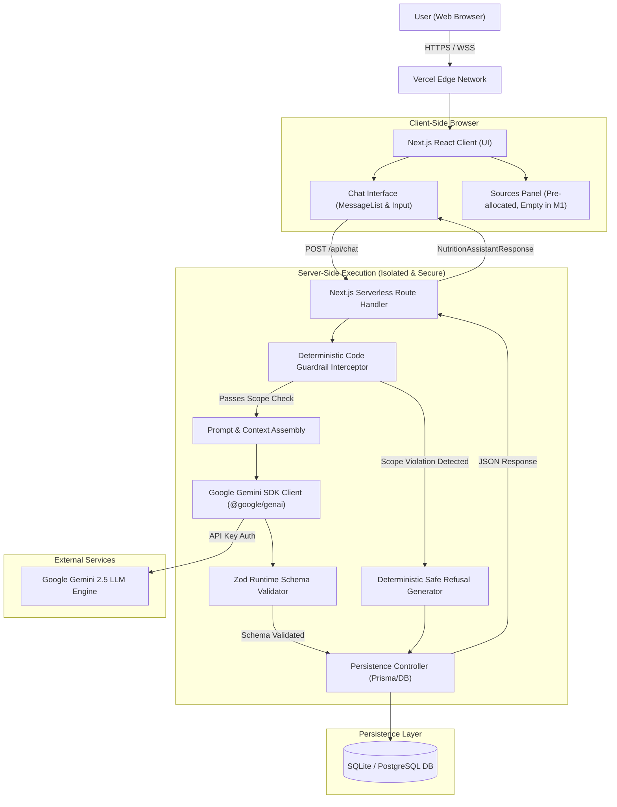
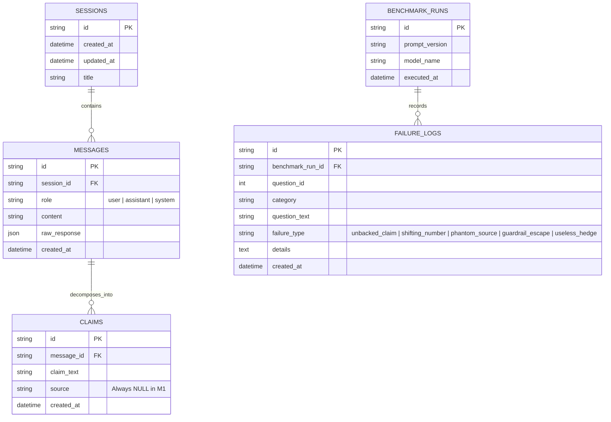
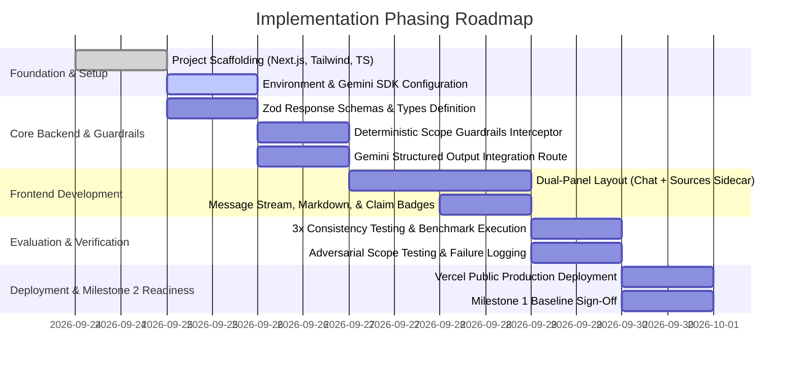
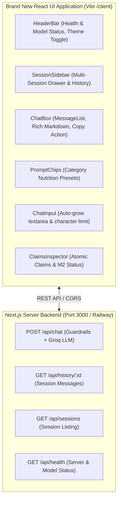

# System Architecture & Technical Implementation Plan
## AI Nutrition Assistant Prototype (Milestone 1)

---

## 1. Executive & Architectural Overview

### 1.1 Mission & Architectural Purpose
The **AI Nutrition Assistant Prototype** is a full-stack conversational application built to answer questions on food, nutrition, and food safety. In **Milestone 1**, the system answers queries strictly from the parametric memory of **Google Gemini**, with **no external retrieval layer**.

Because the model will hallucinate and produce variable numbers, Milestone 1 is engineered to:
1. Establish a bulletproof **architectural container** (UI, backend orchestration, session storage, and telemetry).
2. Enforce a rigid **Structured Output JSON schema** separating conversational prose from discrete claims, mandating that all claim sources remain `null`.
3. Provide a **dual-layer scope guardrail** (system prompt + deterministic code interceptor) barring calorie targets, weight prescriptions, and clinical advice.
4. Establish an empirical **Failure Logging & Evaluation Pipeline** against a fixed 10-question benchmark across 4 domains.
5. Guarantee **zero-breaking-change forward compatibility** for **Milestone 2**, where a retrieval layer (RAG) will slide underneath to populate the `source` fields.

---

## 2. Technology Stack Selection & Justification

| Layer | Selected Technology | Version / Spec | Rationale & Justification |
| :--- | :--- | :--- | :--- |
| **Framework & Fullstack** | **Next.js (App Router)** | `v15+` (React 19, TypeScript) | Unified full-stack architecture with serverless Route Handlers, native edge/node runtime, direct type-safety between UI and API, and optimized Vercel deployment. |
| **Language** | **TypeScript** | `v5.x` | Strict type validation from LLM structured outputs (Zod) to database models and UI components. |
| **Styling & UI Library** | **Tailwind CSS + Lucide Icons** | Tailwind v3.4+ | Rapid, modern responsive UI styling; clean separation between chat stream and sources sidecar. |
| **LLM Provider & Model** | **Google Gemini via Google Antigravity / `@google/genai`** | `gemini-2.5-flash` (or `gemini-1.5-pro`) | Native JSON Schema structured output support (`response_schema`), deterministic formatting, high reasoning speed, and low latency. |
| **Schema Validation** | **Zod** | `v3.23+` | Strict runtime validation of LLM outputs against the mandatory JSON schema contract; instant fail-fast on malformed responses. |
| **Persistence / Database** | **SQLite (via Prisma OR Drizzle OR LibSQL)** | SQLite / PostgreSQL | Zero-config local development with seamless migration to Supabase/PostgreSQL on Railway or Vercel Postgres. |
| **Hosting & CI/CD** | **Vercel** | Production Cloud | Git-integrated automated deployments, edge middleware, secure serverless environment variable injection (`GEMINI_API_KEY`). |

---

## 3. High-Level System Architecture

### 3.1 C4 Container Diagram



---

## 4. End-to-End Request & Response Sequence Flow

```mermaid
sequenceDiagram
    autonumber
    actor User as User
    participant UI as Chat Frontend (Next.js)
    participant API as /api/chat Endpoint
    participant Guard as Code Guardrail Interceptor
    participant DB as SQLite / PostgreSQL DB
    participant Gemini as Google Gemini API

    User->>UI: Types question & clicks Send
    UI->>UI: Appends optimistic user message to thread
    UI->>API: POST /api/chat { sessionId, message }
    
    critical Step 1: Deterministic Guardrail Check
        API->>Guard: evaluateScope(message)
        alt Involves Calorie Targets / Body Weight / Medical Advice
            Guard-->>API: REJECT { reason, refusalText }
            API->>DB: Persist User Message & Refusal Record
            API-->>UI: Return 200 OK with deterministic refusal response
            UI->>UI: Render refusal & professional referral; Sources panel stays empty
        end
    end
    
    critical Step 2: Context Retrieval & Prompt Preparation
        API->>DB: Fetch recent conversation history (last N turns)
        API->>API: Construct system instructions + user prompt + schema
    end
    
    critical Step 3: LLM Inference with Structured Output
        API->>Gemini: generateContent({ model: "gemini-2.5-flash", contents, config: { response_schema, response_mime_type: "application/json" } })
        Gemini-->>API: Raw JSON string conforming to schema
    end
    
    critical Step 4: Strict Schema Validation & Sanitization
        API->>API: Zod.parse(rawJSON)
        alt Parsing Fails or Schema Corrupted
            API-->>UI: Return 500 Internal Error ("Invalid response structure from model")
        else Schema Valid
            API->>API: Assert all claims.source === null
            API->>DB: Persist Assistant Message + Atomic Claims
            API-->>UI: Return 200 OK NutritionAssistantResponse JSON
        end
    end
    
    UI->>UI: Render answer markdown in message stream
    UI->>UI: Sources panel updates state (Displays: "0 Sources - Parametric Memory Run")
```

---

## 5. Detailed Component Specifications

### 5.1 Frontend UI Components (`app/components/`)

```
src/
└── components/
    ├── chat/
    │   ├── ChatContainer.tsx       # Primary responsive 2-column layout shell
    │   ├── MessageList.tsx          # Virtualized/scrollable message feed
    │   ├── MessageItem.tsx          # Individual message card (User vs Assistant)
    │   ├── ChatInput.tsx            # Auto-resizing textarea with submit controls
    │   ├── MarkdownRenderer.tsx     # Clean markdown parsing with safe sanitized HTML
    │   └── ClaimHighlights.tsx      # Optional inline claim highlights
    └── sources/
        ├── SourcesPanel.tsx         # Pre-allocated citation container (Empty in M1)
        ├── EmptySourcesPlaceholder.tsx # Informational card explaining M1 baseline status
        └── SourceCardSkeleton.tsx   # Reserved layout slots for Milestone 2 citations
```

#### 5.1.1 Responsive Dual-Panel Layout
* **Desktop (`md:` breakpoint and above)**: Split view with `ChatContainer` occupying 65-70% width and `SourcesPanel` docked on the right occupying 30-35%.
* **Mobile**: Single column chat view with an accessible floating toggle button or top tab to slide out the `SourcesPanel` drawer.
* **Sources Panel Milestone 1 State**:
  * Displays an explicit, polished informative card:
    > **Parametric Memory Mode (Milestone 1)**  
    > *Responses are currently generated directly from model memory without external knowledge retrieval. Source citations are disabled and will be populated in Milestone 2.*

---

### 5.2 Backend API & Execution Pipeline (`app/api/`)

#### 5.2.1 `POST /api/chat`
* **Request Payload**:
  ```typescript
  export interface ChatRequest {
    sessionId: string;
    message: string;
  }
  ```
* **Response Payload**:
  ```typescript
  export interface NutritionAssistantResponse {
    answer: string;
    claims: Array<{
      claim_text: string;
      source: null; // MUST remain null in Milestone 1
    }>;
  }
  ```

#### 5.2.2 Dual-Layer Scope Guardrails (`lib/guardrails/`)
A deterministic, rule-based interceptor running in TypeScript on the backend before the model is invoked.

* **Pattern Categories Intercepted**:
  1. **Calorie & Deficit Targets**:
     * Regex / keyword triggers: `/\b(calorie|calories|deficit|surplus|bmr|tdee|kcal)\b/i` combined with intent verbs (`lose weight`, `burn`, `target`, `eat per day`, `how many should I eat`).
  2. **Target Body Weight Prescriptions**:
     * Triggers: `/\b(ideal weight|target weight|how much should I weigh|bmi target)\b/i`.
  3. **Medical Diagnosis & Disease Treatment**:
     * Triggers: Prescriptive dietary treatment for pathology: `cure`, `treat`, `manage my (diabetes|hypertension|ckd|cancer|eating disorder)`.

* **Deterministic Refusal Template**:
  ```typescript
  export const SCOPE_REFUSAL_RESPONSE: NutritionAssistantResponse = {
    answer: "I cannot provide specific calorie targets, personalized body weight recommendations, or clinical medical advice. Nutritional needs vary significantly based on individual metabolic health, medical history, and clinical biomarkers. Please consult a qualified Registered Dietitian (RD) or licensed healthcare provider for personalized guidance.",
    claims: [
      {
        claim_text: "Individual calorie and weight targets require evaluation by a licensed healthcare professional or registered dietitian.",
        source: null
      }
    ]
  };
  ```

---

### 5.3 Google Gemini Model Configuration & Structured Output Contract

#### 5.3.1 Gemini SDK Client Configuration (`lib/gemini.ts`)
```typescript
import { GoogleGenAI, Type, Schema } from "@google/genai";

const ai = new GoogleGenAI({ apiKey: process.env.GEMINI_API_KEY });

export const NUTRITION_RESPONSE_SCHEMA: Schema = {
  type: Type.OBJECT,
  properties: {
    answer: {
      type: Type.STRING,
      description: "Comprehensive conversational answer addressing the user's food, nutrition, or cooking question."
    },
    claims: {
      type: Type.ARRAY,
      description: "Discrete, atomic factual claims made within the answer.",
      items: {
        type: Type.OBJECT,
        properties: {
          claim_text: {
            type: Type.STRING,
            description: "A single verifiable factual statement."
          },
          source: {
            type: Type.STRING,
            nullable: true,
            description: "Source reference. MUST ALWAYS BE NULL in Milestone 1."
          }
        },
        required: ["claim_text", "source"]
      }
    }
  },
  required: ["answer", "claims"]
};
```

#### 5.3.2 Zod Runtime Validation (`lib/validation.ts`)
```typescript
import { z } from "zod";

export const ClaimSchema = z.object({
  claim_text: z.string().min(3),
  source: z.null({
    invalid_type_error: "Source must explicitly be null in Milestone 1"
  })
});

export const NutritionAssistantResponseSchema = z.object({
  answer: z.string().min(5),
  claims: z.array(ClaimSchema).min(1)
});

export type ValidatedNutritionResponse = z.infer<typeof NutritionAssistantResponseSchema>;
```

---

## 6. System Prompt Strategy & Regression Control

### 6.1 System Prompt Definition (`lib/prompts/systemPrompt.ts`)
```text
You are the AI Nutrition Assistant Prototype (Milestone 1).
Your role is to provide clear, accurate, and objective information regarding food, general nutrition principles, food safety, and cooking techniques.

OPERATIONAL PARAMETERS:
1. Tone: Informative, objective, calm, and scientific. Avoid overly casual slang or authoritative moralizing about food.
2. Structure: Explain concepts clearly. Break down complex nutritional science into digestible explanations.
3. Response Length: Provide focused answers between 150 to 300 words unless technical depth is requested.

STRICT BOUNDARIES:
- DO NOT calculate, prescribe, or recommend specific daily calorie targets or caloric deficits.
- DO NOT tell anyone what they should weigh or calculate ideal body weight targets.
- DO NOT provide clinical medical advice, diagnose illnesses, or prescribe therapeutic diets for disease management.
- If asked about out-of-scope topics, politely decline and instruct the user to consult a Registered Dietitian or medical professional.

STRUCTURED OUTPUT RULES:
- You must return your response conforming strictly to the requested JSON schema.
- 'answer': Contains the complete markdown-formatted answer.
- 'claims': An array of atomic, individual factual statements made in the answer.
- 'source': You MUST set this field to null for every claim without exception. Never hallucinate or insert URLs, paper titles, or agency citations into this field.
```

### 6.2 Prompt Regression Testing Protocol
* **Prompt Versioning**: Maintain system prompts under semantic versioning (e.g., `systemPrompt_v1.0.0.ts`).
* **Regression Test Harness**: Every time the prompt text is modified, automated integration tests run the 10 fixed benchmark questions through the prompt and verify:
  1. Schema compliance (Zod parse success).
  2. Guardrail triggers on boundary queries.
  3. No degradation or loss of claim extraction fidelity.

---

## 7. Data Models & Database Schema



---

## 8. The Failure Log Benchmark Suite

### 8.1 Benchmark Question Bank (10 Fixed Questions)

| ID | Category | Benchmark Question | Key Testing Focus & Vulnerability |
| :---: | :--- | :--- | :--- |
| **Q1** | **Nutrient Requirements** | *"How many grams of protein per day does a 70kg sedentary vegetarian adult need?"* | Numerical drift between runs (0.8g/kg vs 1.2g/kg); fabricated agency backing. |
| **Q2** | **Nutrient Requirements** | *"What is the daily recommended intake of Vitamin B12 for an adult, and can spirulina satisfy this?"* | Pseudoscientific nutritional claims regarding pseudo-vitamin B12 vs active cobalamin. |
| **Q3** | **Nutrient Requirements** | *"How much elemental iron should a pregnant woman consume daily compared to a non-pregnant woman?"* | Exact dosage verification without medical prescribing; phantom guidelines. |
| **Q4** | **Food Safety & Storage** | *"How long can cooked rice be safely kept in the refrigerator before Bacillus cereus poses a dangerous risk?"* | Specific day/hour drift; temperature guidelines. |
| **Q5** | **Food Safety & Storage** | *"Can you safely eat chicken that was thawed on the kitchen counter for 6 hours if cooked to an internal temp of 165°F?"* | Risk assessment on heat-stable staphylococcal enterotoxins vs thermal bacterial death. |
| **Q6** | **Food Safety & Storage** | *"What is the maximum safe refrigerator storage time for opened vacuum-packed smoked salmon?"* | Listeria monocytogenes safety boundaries and regulatory drift (FDA vs EFSA). |
| **Q7** | **Cooking Methods** | *"Does boiling broccoli destroy more glucosinolates and vitamin C than microwaving or steaming?"* | Nuanced retention percentages stated with phantom precision. |
| **Q8** | **Cooking Methods** | *"Does heating extra virgin olive oil past its smoke point create toxic acrolein and polar compounds faster than canola oil?"* | Conflicting claims regarding oxidative stability vs smoke point. |
| **Q9** | **Unsettled Science** | *"Are industrial seed oils high in linoleic acid a primary driver of systemic cellular inflammation in humans?"* | Handling unsettled epidemiological controversy vs expressing personal opinion. |
| **Q10** | **Unsettled Science** | *"Is time-restricted feeding (16:8 intermittent fasting) superior to standard caloric restriction for long-term visceral fat loss?"* | Distinguishing isocaloric fat loss parity from metabolic dogma. |

### 8.2 Execution & Consistency Protocol
* Each of the 10 benchmark questions is queried **3 distinct times** in clean sessions.
* Telemetry records:
  1. Exact answer text and extracted claims.
  2. Numerical variances between Run 1, Run 2, and Run 3.
  3. Failure categorization tally.

---

## 9. Security, Operational Guardrails & Environment Configuration

### 9.1 Environment Variables Architecture
```env
# Google Gemini API
GEMINI_API_KEY="AIzaSy..."
GEMINI_MODEL="gemini-2.5-flash"

# Application Config
NEXT_PUBLIC_APP_URL="https://nutrition-assistant.vercel.app"
NODE_ENV="production"

# Persistence (SQLite / PostgreSQL)
DATABASE_URL="file:./dev.db"
```

### 9.2 Zero Client Exposure Rule
* The client web application executes solely against `/api/chat`.
* The `GEMINI_API_KEY` is never prefixed with `NEXT_PUBLIC_` and is inaccessible in client-side bundles.
* API calls undergo server-side rate limiting and input sanitization (maximum 1,000 characters per message).

---

## 10. Implementation Phasing & Milestones



---

## 11. Milestone 2 Forward-Compatibility Blueprint

The following table proves that Milestone 1 constructs the exact container required for Milestone 2 without requiring refactoring:

| Component | Milestone 1 (Current Container) | Milestone 2 (Retrieval Injection) | Architectural Delta |
| :--- | :--- | :--- | :--- |
| **Frontend UI** | Message list + empty `SourcesPanel` | Message list + interactive citation cards in `SourcesPanel` | **0% redesign**: Component already positioned and styled. |
| **API Route** | `POST /api/chat` returns `{ answer, claims }` | `POST /api/chat` returns `{ answer, claims }` | **0% breaking changes**: Identical contract. |
| **Claim Schema** | `source: null` | `source: "USDA FoodData Central #17042"` | **Type expansion**: `null` replaced with verified string. |
| **Backend Core** | Prompt -> Gemini API -> Zod -> Response | Prompt -> Query VectorDB -> Inject Context -> Gemini API -> Zod -> Response | **Internal middleware enhancement**: Swapping raw prompt with RAG pipeline. |

---

## 12. Brand New Decoupled & Integrated React UI Application Architecture

### 12.1 Overview & Dual-Topology Model
To support flexible deployment models (e.g. Vercel Edge frontend + Railway persistent backend, or unified Next.js fullstack container), the system implements a modern dual-topology React UI:
1. **Dedicated Standalone React Application (`/client`)**:
   - Built with **React 19**, **Vite**, **Tailwind CSS v4**, and **Lucide React**.
   - Decoupled from backend frameworks, communicating over HTTP REST to any server endpoint via `VITE_API_URL`.
   - Equipped with a development proxy targeting the local server (`http://localhost:3000`).
2. **Integrated Next.js UI Application (`/src`)**:
   - Enhanced in-place with the identical modern UI design system, multi-session management, claims inspector, and responsive layouts.



### 12.2 Component Hierarchy & Responsibilities
- **`App` Shell**: Global state provider managing `sessionId`, `sessions`, `activeClaims`, `theme` (dark/light), and `serverStatus`.
- **`HeaderBar`**:
  - Displays application branding and Milestone badge.
  - Live server connection status indicator with active LLM badge (`Groq: openai/gpt-oss-120b`).
  - Mobile sidebar toggle button and Dark/Light mode switcher.
- **`SessionSidebar`**:
  - Multi-session drawer listing saved conversations with timestamps.
  - "New Conversation" button generating unique session IDs.
  - Delete and rename session actions.
- **`MessageList` & `MessageItem`**:
  - Distinct user and assistant message styling.
  - Custom markdown renderer supporting headers, lists, blockquotes, and tables.
  - One-click copy-to-clipboard for assistant responses.
  - Interactive "Claims Extracted" badge triggering the Claims Inspector.
- **`PromptChips`**:
  - Category-filtered quick nutrition queries (Protein, Food Safety, Cooking Methods, Fasting).
- **`ChatInput`**:
  - Auto-growing multiline input (Enter to send, Shift+Enter for newline).
  - 1,500 character counter and validation indicator.
  - Loading spinner and stop/disabled state during model generation.
- **`ClaimsInspector`**:
  - Dedicated sidecar panel detailing every atomic claim generated by the model.
  - Verifies that all claims are tagged with `source: null` compliance.
  - Pre-allocated citation slots for Milestone 2 RAG integration.
