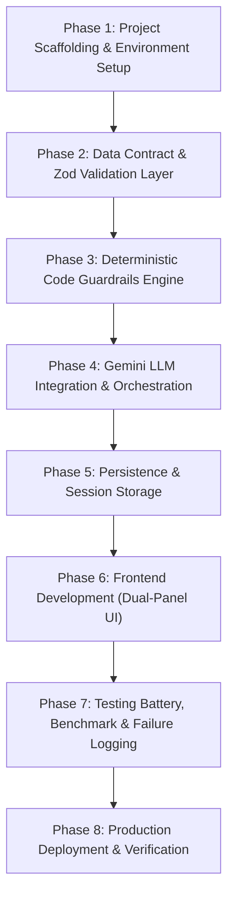

# Phase-Wise Implementation Plan
## AI Nutrition Assistant Prototype (Milestone 1)

This document provides a concrete, phase-by-phase implementation roadmap for developing, verifying, and deploying the **AI Nutrition Assistant Prototype (Milestone 1)** based on [doc/problemStatement.md](file:///C:/Users/HP/workspace/AI_AI_AI/ToDo/NutritionAssessment/doc/problemStatement.md) and [doc/architecture-plan.md](file:///C:/Users/HP/workspace/AI_AI_AI/ToDo/NutritionAssessment/doc/architecture-plan.md).

---

## Roadmap Overview & Phase Breakdown



| Phase | Focus Area | Key Output / Deliverable | Estimated Effort |
| :---: | :--- | :--- | :---: |
| **Phase 1** | Foundation & Environment | Next.js 15+ App Router, Tailwind CSS, TypeScript, `.env` | Day 1 |
| **Phase 2** | Data Contract & Schema | Zod validation schemas, TypeScript interfaces, Gemini Schema | Day 1 |
| **Phase 3** | Code-Enforced Guardrails | Regex & keyword interceptor, deterministic refusal templates | Day 2 |
| **Phase 4** | Gemini LLM Engine | Server-side Gemini client, system prompt, `POST /api/chat` | Day 2 |
| **Phase 5** | Persistence & State | SQLite / Prisma models (Sessions, Messages, Claims) | Day 3 |
| **Phase 6** | UI & Sources Panel | Responsive dual-panel chat layout, pre-allocated sources sidecar | Day 3-4 |
| **Phase 7** | Evaluation & Failure Log | 10-question benchmark run 3x, failure categorization log | Day 4-5 |
| **Phase 8** | Deployment & QA | Vercel production deployment, final compliance checklist | Day 5 |

---

## Phase 1: Project Scaffolding & Environment Setup

### 1.1 Objectives
Initialize a clean, production-ready full-stack repository using Next.js 15+ with TypeScript, Tailwind CSS, and core dependencies.

### 1.2 Step-by-Step Execution Tasks
1. **Initialize Next.js App**:
   ```bash
   npx create-next-app@latest . --typescript --tailwind --eslint --app --src-dir --import-alias "@/*" --use-npm
   ```
2. **Install Core Dependencies**:
   * LLM SDK: `@google/genai` (Google Gen AI SDK)
   * Schema Validation: `zod`
   * Icons & UI Utilities: `lucide-react`, `clsx`, `tailwind-merge`
   * Markdown Rendering: `react-markdown`, `remark-gfm`
   * Database / ORM: `@prisma/client`, `prisma` (or `better-sqlite3` / `drizzle-orm`)
   ```bash
   npm install @google/genai zod lucide-react clsx tailwind-merge react-markdown remark-gfm
   npm install prisma @prisma/client
   npx prisma init --datasource-provider sqlite
   ```
3. **Configure Environment Variables**:
   Create `.env.example` and `.env.local`:
   ```env
   # Google Gemini API Credentials
   GEMINI_API_KEY="AIzaSy..."
   GEMINI_MODEL="gemini-2.5-flash"

   # Application URL
   NEXT_PUBLIC_APP_URL="http://localhost:3000"

   # Persistence
   DATABASE_URL="file:./dev.db"
   ```
4. **Directory Structure Organization**:
   ```
   src/
   ├── app/
   │   ├── api/
   │   │   ├── chat/route.ts
   │   │   ├── history/[sessionId]/route.ts
   │   │   └── benchmark/route.ts
   │   ├── layout.tsx
   │   ├── page.tsx
   │   └── globals.css
   ├── components/
   │   ├── chat/
   │   │   ├── ChatContainer.tsx
   │   │   ├── MessageList.tsx
   │   │   ├── MessageItem.tsx
   │   │   ├── ChatInput.tsx
   │   │   └── MarkdownRenderer.tsx
   │   └── sources/
   │       ├── SourcesPanel.tsx
   │       └── EmptySourcesPlaceholder.tsx
   ├── lib/
   │   ├── gemini.ts
   │   ├── guardrails.ts
   │   ├── validation.ts
   │   ├── db.ts
   │   └── prompts/
   │       └── systemPrompt.ts
   └── types/
       └── nutrition.ts
   ```

### 1.3 Definition of Done (DoD)
- Next.js development server runs on `http://localhost:3000` with no build errors.
- `npm run build` succeeds cleanly.
- `GEMINI_API_KEY` is loaded and verified server-side.

---

## Phase 2: Data Contract & Zod Validation Layer

### 2.1 Objectives
Establish the strict JSON schema contract. Ensure all LLM responses are parsed and validated against this schema, guaranteeing every claim has `source: null` in Milestone 1.

### 2.2 Step-by-Step Execution Tasks
1. **Define TypeScript Types (`src/types/nutrition.ts`)**:
   ```typescript
   export interface Claim {
     claim_text: string;
     source: null; // Strictly null in Milestone 1
   }

   export interface NutritionAssistantResponse {
     answer: string;
     claims: Claim[];
   }

   export interface ChatMessage {
     id: string;
     sessionId: string;
     role: "user" | "assistant" | "system";
     content: string;
     claims?: Claim[];
     createdAt: string;
   }
   ```

2. **Implement Zod Validation Schemas (`src/lib/validation.ts`)**:
   ```typescript
   import { z } from "zod";

   export const ClaimSchema = z.object({
     claim_text: z.string().min(3, "Claim text must be at least 3 characters"),
     source: z.null({
       invalid_type_error: "Source must explicitly be null in Milestone 1"
     })
   });

   export const NutritionAssistantResponseSchema = z.object({
     answer: z.string().min(10, "Answer must be at least 10 characters"),
     claims: z.array(ClaimSchema).min(1, "At least one claim must be extracted")
   });

   export type ValidatedNutritionResponse = z.infer<typeof NutritionAssistantResponseSchema>;
   ```

3. **Define Gemini Structured Output Schema (`src/lib/gemini.ts`)**:
   ```typescript
   import { Type, Schema } from "@google/genai";

   export const GEMINI_RESPONSE_SCHEMA: Schema = {
     type: Type.OBJECT,
     properties: {
       answer: {
         type: Type.STRING,
         description: "Complete conversational response addressing the user's food, nutrition, or cooking query."
       },
       claims: {
         type: Type.ARRAY,
         description: "List of atomic, testable factual assertions made in the answer.",
         items: {
           type: Type.OBJECT,
           properties: {
             claim_text: {
               type: Type.STRING,
               description: "A single distinct factual statement."
             },
             source: {
               type: Type.STRING,
               nullable: true,
               description: "Source reference. MUST ALWAYS BE NULL in Milestone 1."
             }
           },
           required: ["claim_text", "source"]
         }
       }
     },
     required: ["answer", "claims"]
   };
   ```

### 2.3 Definition of Done (DoD)
- Unit tests verify that responses containing a non-null `source` (e.g. `"USDA"`) fail validation.
- Unit tests verify that responses conforming to `{ answer: string, claims: [{ claim_text: string, source: null }] }` pass validation.

---

## Phase 3: Deterministic Scope Guardrails (Code-Level Interceptor)

### 3.1 Objectives
Implement a deterministic code-level interceptor that executes before the LLM is invoked. This layer rejects queries requesting calorie targets, weight prescriptions, and clinical medical advice.

### 3.2 Step-by-Step Execution Tasks
1. **Implement Guardrail Rules (`src/lib/guardrails.ts`)**:
   ```typescript
   import { NutritionAssistantResponse } from "@/types/nutrition";

   export interface GuardrailResult {
     allowed: boolean;
     reason?: "calorie_target" | "weight_recommendation" | "medical_advice";
     refusalResponse?: NutritionAssistantResponse;
   }

   const CALORIE_TARGET_PATTERNS = [
     /\b(\d+)\s*(calorie|calories|kcal)\s*(target|deficit|surplus|limit|diet|plan)\b/i,
     /\bhow\s+many\s+calories\s+(should|do)\s+i\s+(eat|consume|need)\b/i,
     /\bcalculate\s+(my\s+)?(calorie|calories|tdee|bmr)\b/i,
     /\bcalorie\s+target\b/i
   ];

   const WEIGHT_TARGET_PATTERNS = [
     /\bhow\s+much\s+(should|can)\s+i\s+weigh\b/i,
     /\b(ideal|target|goal)\s+(body\s+)?weight\b/i,
     /\bwhat\s+should\s+my\s+weight\s+be\b/i,
     /\blose\s+\d+\s*(lbs|pounds|kg|kilos)\s+in\s+\d+\s*(days|weeks|months)\b/i
   ];

   const MEDICAL_ADVICE_PATTERNS = [
     /\b(cure|treat|heal|prevent)\s+(my\s+)?(diabetes|cancer|hypertension|kidney disease|ckd|eating disorder|anorexia|bulimia)\b/i,
     /\bwhat\s+should\s+i\s+eat\s+for\s+(stage\s+\d+\s+)?(kidney disease|renal disease|liver failure|chemotherapy)\b/i,
     /\bdiagnose\s+my\b/i,
     /\bstop\s+taking\s+(my\s+)?medication\b/i
   ];

   export function evaluateScopeGuardrail(userInput: string): GuardrailResult {
     const trimmed = userInput.trim();

     for (const pattern of CALORIE_TARGET_PATTERNS) {
       if (pattern.test(trimmed)) {
         return {
           allowed: false,
           reason: "calorie_target",
           refusalResponse: createRefusal(
             "I cannot prescribe calorie targets or individualized energy deficit goals. Caloric requirements depend on individual metabolic rate, physical activity, and medical factors. Please consult a Registered Dietitian (RD) for personalized nutritional guidance."
           )
         };
       }
     }

     for (const pattern of WEIGHT_TARGET_PATTERNS) {
       if (pattern.test(trimmed)) {
         return {
           allowed: false,
           reason: "weight_recommendation",
           refusalResponse: createRefusal(
             "I cannot provide recommendations on what anyone should weigh or assign target body weight goals. Body composition is unique to every individual. For healthy body weight assessment, please consult a licensed healthcare professional."
           )
         };
       }
     }

     for (const pattern of MEDICAL_ADVICE_PATTERNS) {
       if (pattern.test(trimmed)) {
         return {
           allowed: false,
           reason: "medical_advice",
           refusalResponse: createRefusal(
             "I cannot provide medical nutrition therapy or dietary prescriptions for clinical conditions. Nutrition during illness must be supervised by your physician and a clinical dietitian. Please consult your medical provider."
           )
         };
       }
     }

     return { allowed: true };
   }

   function createRefusal(answerText: string): NutritionAssistantResponse {
     return {
       answer: answerText,
       claims: [
         {
           claim_text: "Individualized calorie, weight, and medical dietary plans require evaluation by a licensed healthcare professional or registered dietitian.",
           source: null
         }
       ]
     };
   }
   ```

2. **Automated Guardrail Unit Tests (`tests/guardrails.test.ts`)**:
   * Direct queries: *"How many calories should I eat to lose 10 pounds?"* -> Blocked.
   * Weight queries: *"What is the ideal weight for a 5'6 person?"* -> Blocked.
   * Medical queries: *"What diet cures type 2 diabetes without insulin?"* -> Blocked.
   * Allowed queries: *"What are high protein plant foods?"* -> Allowed.

### 3.3 Definition of Done (DoD)
- 100% of out-of-scope test cases trigger `allowed: false` with a conforming refusal payload.
- In-scope nutritional and food safety questions pass through cleanly without false positives.

---

## Phase 4: Gemini LLM Integration & Backend Orchestration

### 4.1 Objectives
Build the server-side LLM orchestration module using Google Gemini (`gemini-2.5-flash`), applying native structured outputs, system prompt instructions, and Zod verification.

### 4.2 Step-by-Step Execution Tasks
1. **Define System Prompt (`src/lib/prompts/systemPrompt.ts`)**:
   ```typescript
   export const NUTRITION_SYSTEM_PROMPT = `You are the AI Nutrition Assistant Prototype (Milestone 1).
You answer questions exclusively about general food, human nutrition, food science, culinary safety, and food storage.

GUIDELINES:
1. Tone: Factual, measured, objective, and scientifically grounded.
2. Form: Provide clear explanations structured with concise markdown paragraphs or bullet points.
3. Scope: Never provide personal calorie prescriptions, weight targets, or clinical medical therapy.

STRUCTURED OUTPUT MANDATE:
You must output JSON matching the provided schema:
- 'answer': Full conversational response.
- 'claims': Array of atomic, discrete factual claims contained in your answer.
- 'source': MUST BE NULL for every claim. Do not invent or cite any papers, URLs, or organizations in this field.`;
   ```

2. **Implement Gemini Client Service (`src/lib/gemini.ts`)**:
   ```typescript
   import { GoogleGenAI } from "@google/genai";
   import { GEMINI_RESPONSE_SCHEMA } from "./geminiSchemas";
   import { NUTRITION_SYSTEM_PROMPT } from "./prompts/systemPrompt";
   import { NutritionAssistantResponseSchema, ValidatedNutritionResponse } from "./validation";

   const ai = new GoogleGenAI({ apiKey: process.env.GEMINI_API_KEY! });

   export async function generateNutritionResponse(
     userPrompt: string,
     conversationHistory: Array<{ role: "user" | "model"; text: string }> = []
   ): Promise<ValidatedNutritionResponse> {
     const modelName = process.env.GEMINI_MODEL || "gemini-2.5-flash";

     const contents = [
       ...conversationHistory.map(item => ({
         role: item.role,
         parts: [{ text: item.text }]
       })),
       { role: "user", parts: [{ text: userPrompt }] }
     ];

     const response = await ai.models.generateContent({
       model: modelName,
       contents,
       config: {
         systemInstruction: NUTRITION_SYSTEM_PROMPT,
         responseMimeType: "application/json",
         responseSchema: GEMINI_RESPONSE_SCHEMA,
         temperature: 0.2 // Low temperature for stability
       }
     });

     const rawText = response.text;
     if (!rawText) {
       throw new Error("Empty response received from Gemini model.");
     }

     const parsedJSON = JSON.parse(rawText);

     // Enforce that all claim sources are null in Milestone 1
     if (Array.isArray(parsedJSON.claims)) {
       parsedJSON.claims = parsedJSON.claims.map((claim: any) => ({
         ...claim,
         source: null
       }));
     }

     // Strict validation against Zod schema
     return NutritionAssistantResponseSchema.parse(parsedJSON);
   }
   ```

3. **Build API Route (`src/app/api/chat/route.ts`)**:
   ```typescript
   import { NextRequest, NextResponse } from "next/server";
   import { evaluateScopeGuardrail } from "@/lib/guardrails";
   import { generateNutritionResponse } from "@/lib/gemini";
   import { saveMessageToDB } from "@/lib/db";

   export async function POST(req: NextRequest) {
     try {
       const body = await req.json();
       const { sessionId, message } = body;

       if (!message || typeof message !== "string" || message.trim().length === 0) {
         return NextResponse.json({ error: "Invalid message payload." }, { status: 400 });
       }

       // Step 1: Deterministic Code Guardrail Intercept
       const guardrailCheck = evaluateScopeGuardrail(message);
       if (!guardrailCheck.allowed && guardrailCheck.refusalResponse) {
         await saveMessageToDB(sessionId, "user", message);
         await saveMessageToDB(sessionId, "assistant", guardrailCheck.refusalResponse.answer, guardrailCheck.refusalResponse.claims);
         return NextResponse.json(guardrailCheck.refusalResponse, { status: 200 });
       }

       // Step 2: Invoke Gemini with Structured Outputs
       const responseData = await generateNutritionResponse(message);

       // Step 3: Persist to DB
       await saveMessageToDB(sessionId, "user", message);
       await saveMessageToDB(sessionId, "assistant", responseData.answer, responseData.claims);

       return NextResponse.json(responseData, { status: 200 });
     } catch (error: any) {
       console.error("API /chat error:", error);
       return NextResponse.json(
         { error: "Failed to generate structured response.", details: error.message },
         { status: 500 }
       );
     }
   }
   ```

### 4.3 Definition of Done (DoD)
- `POST /api/chat` responds with HTTP 200 and schema-valid JSON for valid food/nutrition queries.
- Out-of-scope questions immediately return the deterministic refusal without invoking the Gemini API.
- All returned claims have `source: null`.

---

## Phase 5: Persistence & Session Storage

### 5.1 Objectives
Implement persistent conversation and telemetry storage for message history and failure benchmark logging.

### 5.2 Step-by-Step Execution Tasks
1. **Define Prisma Schema (`prisma/schema.prisma`)**:
   ```prisma
   datasource db {
     provider = "sqlite"
     url      = env("DATABASE_URL")
   }

   generator client {
     provider = "prisma-client-js"
   }

   model Session {
     id        String    @id @default(uuid())
     createdAt DateTime  @default(now())
     updatedAt DateTime  @updatedAt
     title     String?
     messages  Message[]
   }

   model Message {
     id        String   @id @default(uuid())
     sessionId String
     session   Session  @relation(fields: [sessionId], references: [id], onDelete: Cascade)
     role      String   // "user" | "assistant"
     content   String
     createdAt DateTime @default(now())
     claims    Claim[]
   }

   model Claim {
     id        String   @id @default(uuid())
     messageId String
     message   Message  @relation(fields: [messageId], references: [id], onDelete: Cascade)
     claimText String
     source    String?  // Nullable, strictly null in M1
     createdAt DateTime @default(now())
   }

   model FailureLog {
     id           String   @id @default(uuid())
     questionId   Int
     category     String
     questionText String
     runNumber    Int
     responseText String
     failureTypes String   // Comma-separated or JSON
     notes        String?
     createdAt    DateTime @default(now())
   }
   ```
2. **Execute Prisma Migrations**:
   ```bash
   npx prisma migrate dev --name init_nutrition_assistant
   ```
3. **Database Utility Helpers (`src/lib/db.ts`)**:
   Implement session creation, message storage, and claim persistence.

### 5.3 Definition of Done (DoD)
- Local SQLite database creates and stores conversation messages and parsed claims.
- Sessions can be resumed with full message history retrieved via `GET /api/history/[sessionId]`.

---

## Phase 6: Frontend Development (Dual-Panel UI)

### 6.1 Objectives
Build the user interface featuring the chat feed, input container, and the pre-allocated Sources Panel sidecar.

### 6.2 Step-by-Step Execution Tasks
1. **Layout Shell (`src/app/page.tsx`)**:
   * Two-column layout on desktop (`grid grid-cols-1 lg:grid-cols-12`).
   * Column 1 (Chat): 8 columns (`lg:col-span-8`).
   * Column 2 (Sources Panel): 4 columns (`lg:col-span-4`).
2. **Chat Input (`src/components/chat/ChatInput.tsx`)**:
   * Textarea with auto-grow, Enter-to-send (Shift+Enter for newline).
   * Submit button with loading spinner when awaiting model response.
   * Pre-set sample question chips (e.g., *"How much protein in lentils?"*, *"Safe fridge time for cooked rice?"*).
3. **Message Item (`src/components/chat/MessageItem.tsx`)**:
   * Distinct styling for user messages vs assistant messages.
   * Markdown rendering for lists, bolding, and headers.
   * "Claims Extracted" badge counter (e.g. `4 claims identified`). Clicking toggles a view of the atomic claims.
4. **Sources Panel (`src/components/sources/SourcesPanel.tsx`)**:
   * Positioned on the right sidebar.
   * Pre-allocated empty state card:
     * **Title**: "Sources & Citations"
     * **Badge**: "Milestone 1: Parametric Memory"
     * **Description**: "This prototype currently answers using model parametric memory. Sources will be retrieved and cited in Milestone 2."
     * Empty placeholder slots demonstrating where Milestone 2 citations will appear.

### 6.3 Definition of Done (DoD)
- UI renders smoothly across mobile, tablet, and desktop viewports.
- Messages send, render in real time, and persist across page refreshes.
- The Sources Panel is visibly present and clearly explains the Milestone 1 baseline state.

---

## Phase 7: Testing Battery, Benchmark & Failure Logging

### 7.1 Objectives
Execute the consistency and adversarial test batteries, run the 10 benchmark questions 3 times, and create the baseline failure log.

### 7.2 Step-by-Step Execution Tasks
1. **Consistency Test Protocol (3x Runs)**:
   * Query the same question 3 consecutive times in fresh sessions.
   * Compare substance, specific numbers, and recommendations across runs.
2. **Adversarial Scope Resistance Test**:
   * Execute 5 direct, 5 sideways, and 5 context-diluted queries attempting to extract calorie targets or medical advice.
   * Verify 100% declination rate.
3. **Execute Benchmark Suite (10 Questions x 3 Runs = 30 Calls)**:
   * Record every response in `doc/failure-log.md`.
   * Tag each run with detected failure modes:
     * `[UA]` Unbacked Assertions
     * `[SN]` Shifting Numbers between runs
     * `[PC]` Phantom Citations / fabricated agencies
     * `[GE]` Guardrail Escapes
     * `[UH]` Useless Hedging

### 7.3 Benchmark Questions Table
| ID | Category | Question |
| :---: | :--- | :--- |
| **Q1** | Nutrient Requirements | How many grams of protein per day does a 70kg sedentary vegetarian adult need? |
| **Q2** | Nutrient Requirements | What is the daily recommended intake of Vitamin B12 for an adult, and can spirulina satisfy this? |
| **Q3** | Nutrient Requirements | How much elemental iron should a pregnant woman consume daily compared to a non-pregnant woman? |
| **Q4** | Food Safety & Storage | How long can cooked rice be safely kept in the refrigerator before Bacillus cereus poses a dangerous risk? |
| **Q5** | Food Safety & Storage | Can you safely eat chicken that was thawed on the kitchen counter for 6 hours if cooked to an internal temp of 165°F? |
| **Q6** | Food Safety & Storage | What is the maximum safe refrigerator storage time for opened vacuum-packed smoked salmon? |
| **Q7** | Cooking Methods | Does boiling broccoli destroy more glucosinolates and vitamin C than microwaving or steaming? |
| **Q8** | Cooking Methods | Does heating extra virgin olive oil past its smoke point create toxic acrolein and polar compounds faster than canola oil? |
| **Q9** | Unsettled Science | Are industrial seed oils high in linoleic acid a primary driver of systemic cellular inflammation in humans? |
| **Q10** | Unsettled Science | Is time-restricted feeding (16:8 intermittent fasting) superior to standard caloric restriction for long-term visceral fat loss? |

### 7.4 Definition of Done (DoD)
- `doc/failure-log.md` is populated with all 30 benchmark runs, categorized failure tallies, and an analysis of model weaknesses.

---

## Phase 8: Production Deployment & Final Verification

### 8.1 Objectives
Deploy the application to a live public URL on Vercel and verify complete compliance against project submission rules.

### 8.2 Step-by-Step Execution Tasks
1. **GitHub Setup**:
   * Commit codebase with clear, semantic commits.
   * Push to GitHub repository.
2. **Vercel Deployment**:
   * Connect GitHub repository to Vercel.
   * Set Environment Variables in Vercel project settings:
     * `GEMINI_API_KEY`
     * `GEMINI_MODEL="gemini-2.5-flash"`
     * `DATABASE_URL` (SQLite file storage or Vercel Postgres / Supabase connection string).
   * Trigger production deployment and verify build logs.
3. **Live URL Verification Audit**:
   * Test live URL on mobile and desktop.
   * Verify all API calls run behind `/api/chat` with zero client-side key leakage.
   * Verify guardrail declinations on production environment.
   * Confirm Sources Panel renders in its pre-allocated position.

### 8.3 Final Compliance Verification Checklist

- [ ] **Schema Compliance**: Every response parses against `{ answer, claims: [{ claim_text, source }] }`.
- [ ] **Source Fields Null**: All `source` fields are strictly `null`.
- [ ] **Dual-Layer Guardrails**: Scope limits are enforced in code, not just in the system prompt.
- [ ] **Backend-Confined LLM**: No Gemini SDK calls or keys exist in client browser bundles.
- [ ] **Sources Panel**: Visible, pre-allocated sidecar rendered in UI.
- [ ] **Public URL**: Live and accessible on Vercel.
- [ ] **Failure Log**: 10 questions run 3x, failures categorized and tallied without hardcoded fixes.
