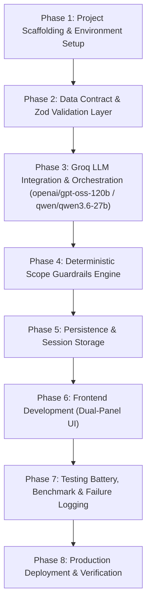

# Phase-Wise Implementation Plan
## AI Nutrition Assistant Prototype (Milestone 1)

This document provides a concrete, phase-by-phase implementation roadmap for developing, verifying, and deploying the **AI Nutrition Assistant Prototype (Milestone 1)** based on [doc/problemStatement.md](file:///C:/Users/HP/workspace/AI_AI_AI/ToDo/NutritionAssessment/doc/problemStatement.md) and [doc/architecture-plan.md](file:///C:/Users/HP/workspace/AI_AI_AI/ToDo/NutritionAssessment/doc/architecture-plan.md).

---

## Roadmap Overview & Phase Breakdown



| Phase | Focus Area | Key Output / Deliverable | Estimated Effort |
| :---: | :--- | :--- | :---: |
| **Phase 1** | Foundation & Environment | Next.js 15+ App Router, Tailwind CSS, TypeScript, `.env` | Day 1 |
| **Phase 2** | Data Contract & Schema | Zod validation schemas, TypeScript interfaces, Structured Output Schema | Day 1 |
| **Phase 3** | Groq LLM Engine & Orchestration | Groq SDK (`openai/gpt-oss-120b` / `qwen/qwen3.6-27b`), JSON mode, `POST /api/chat` | Day 2 |
| **Phase 4** | Code-Enforced Guardrails | Regex & keyword interceptor, deterministic refusal templates, sanitization | Day 2 |
| **Phase 5** | Persistence & State | SQLite / Prisma models (Sessions, Messages, Claims) | Day 3 |
| **Phase 6** | UI & Sources Panel | Responsive dual-panel chat layout, pre-allocated sources sidecar | Day 3-4 |
| **Phase 7** | Evaluation & Failure Log | 10-question benchmark run 3x, failure categorization log | Day 4-5 |
| **Phase 8** | Production Deployment & Verification | Multi-target production deployment (Railway container + volume & Vercel serverless), live URL smoke tests, compliance checklist (see [doc/deployment-plan.md](file:///C:/Users/HP/workspace/AI_AI_AI/ToDo/nutrition-chatbot/doc/deployment-plan.md)) | Day 5 |

---

## Phase 1: Project Scaffolding & Environment Setup

### 1.1 Objectives
Initialize a clean, production-ready full-stack repository using Next.js 15+ with TypeScript, Tailwind CSS, and core dependencies.

### 1.2 Step-by-Step Execution Tasks
1. **Initialize Next.js App**:
   ```bash
   npx create-next-app@latest . --typescript --tailwind --eslint --app --src-dir --import-alias "@/*" --use-npm
   ```
2. **Install Core Dependencies**:
   * LLM SDK: `@google/genai` (Google Gen AI SDK)
   * Schema Validation: `zod`
   * Icons & UI Utilities: `lucide-react`, `clsx`, `tailwind-merge`
   * Markdown Rendering: `react-markdown`, `remark-gfm`
   * Database / ORM: `@prisma/client`, `prisma` (or `better-sqlite3` / `drizzle-orm`)
   ```bash
   npm install @google/genai zod lucide-react clsx tailwind-merge react-markdown remark-gfm
   npm install prisma @prisma/client
   npx prisma init --datasource-provider sqlite
   ```
3. **Configure Environment Variables**:
   Create `.env.example` and `.env.local`:
   ```env
   # Google Gemini API Credentials
   GEMINI_API_KEY="AIzaSy..."
   GEMINI_MODEL="gemini-2.5-flash"

   # Application URL
   NEXT_PUBLIC_APP_URL="http://localhost:3000"

   # Persistence
   DATABASE_URL="file:./dev.db"
   ```
4. **Directory Structure Organization**:
   ```
   src/
   ├── app/
   │   ├── api/
   │   │   ├── chat/route.ts
   │   │   ├── history/[sessionId]/route.ts
   │   │   └── benchmark/route.ts
   │   ├── layout.tsx
   │   ├── page.tsx
   │   └── globals.css
   ├── components/
   │   ├── chat/
   │   │   ├── ChatContainer.tsx
   │   │   ├── MessageList.tsx
   │   │   ├── MessageItem.tsx
   │   │   ├── ChatInput.tsx
   │   │   └── MarkdownRenderer.tsx
   │   └── sources/
   │       ├── SourcesPanel.tsx
   │       └── EmptySourcesPlaceholder.tsx
   ├── lib/
   │   ├── gemini.ts
   │   ├── guardrails.ts
   │   ├── validation.ts
   │   ├── db.ts
   │   └── prompts/
   │       └── systemPrompt.ts
   └── types/
       └── nutrition.ts
   ```

### 1.3 Definition of Done (DoD)
- Next.js development server runs on `http://localhost:3000` with no build errors.
- `npm run build` succeeds cleanly.
- `GEMINI_API_KEY` is loaded and verified server-side.

---

## Phase 2: Data Contract & Zod Validation Layer

### 2.1 Objectives
Establish the strict JSON schema contract. Ensure all LLM responses are parsed and validated against this schema, guaranteeing every claim has `source: null` in Milestone 1.

### 2.2 Step-by-Step Execution Tasks
1. **Define TypeScript Types (`src/types/nutrition.ts`)**:
   ```typescript
   export interface Claim {
     claim_text: string;
     source: null; // Strictly null in Milestone 1
   }

   export interface NutritionAssistantResponse {
     answer: string;
     claims: Claim[];
   }

   export interface ChatMessage {
     id: string;
     sessionId: string;
     role: "user" | "assistant" | "system";
     content: string;
     claims?: Claim[];
     createdAt: string;
   }
   ```

2. **Implement Zod Validation Schemas (`src/lib/validation.ts`)**:
   ```typescript
   import { z } from "zod";

   export const ClaimSchema = z.object({
     claim_text: z.string().min(3, "Claim text must be at least 3 characters"),
     source: z.null({
       invalid_type_error: "Source must explicitly be null in Milestone 1"
     })
   });

   export const NutritionAssistantResponseSchema = z.object({
     answer: z.string().min(10, "Answer must be at least 10 characters"),
     claims: z.array(ClaimSchema).min(1, "At least one claim must be extracted")
   });

   export type ValidatedNutritionResponse = z.infer<typeof NutritionAssistantResponseSchema>;
   ```

3. **Define Structured Output Schema (`src/lib/groq.ts`)**:
   ```typescript
   export const GROQ_RESPONSE_SCHEMA = {
     type: "object",
     properties: {
       answer: {
         type: "string",
         description: "Complete conversational response addressing the user's food, nutrition, or cooking query."
       },
       claims: {
         type: "array",
         description: "List of atomic, testable factual assertions made in the answer.",
         items: {
           type: "object",
           properties: {
             claim_text: {
               type: "string",
               description: "A single distinct factual statement."
             },
             source: {
               type: "null",
               description: "Source reference. MUST ALWAYS BE NULL in Milestone 1."
             }
           },
           required: ["claim_text", "source"]
         }
       }
     },
     required: ["answer", "claims"]
   };
   ```

### 2.3 Definition of Done (DoD)
- Unit tests verify that responses containing a non-null `source` (e.g. `"USDA"`) fail validation.
- Unit tests verify that responses conforming to `{ answer: string, claims: [{ claim_text: string, source: null }] }` pass validation.

---

## Phase 3: Groq LLM Engine Integration & Orchestration (openai/gpt-oss-120b / qwen/qwen3.6-27b)

### 3.1 Objectives
Build the server-side LLM orchestration module powered by **Groq's ultra-fast LPU inference engine** using the official `groq-sdk`. Support open-weight models **`openai/gpt-oss-120b`** (primary default: 120B parameter MoE model with reasoning capabilities) and **`qwen/qwen3.6-27b`** (alternative/fallback: efficient 27B model for high throughput), applying native JSON mode structured outputs, system prompt instructions, exponential jitter backoff, response sanitization, and Zod validation.

### 3.2 Step-by-Step Execution Tasks
1. **Configure Dependencies & Environment Variables**:
   * Install `groq-sdk` in `package.json`.
   * Configure environment variables in `.env.example` and `.env.local`:
     ```env
     # Groq API Credentials
     GROQ_API_KEY="gsk_..."
     GROQ_MODEL="openai/gpt-oss-120b" # Or "qwen/qwen3.6-27b"
     ```

2. **Define System Prompt (`src/lib/prompts/systemPrompt.ts`)**:
   ```typescript
   export const NUTRITION_SYSTEM_PROMPT = `You are the AI Nutrition Assistant Prototype (Milestone 1).
You answer questions exclusively about general food, human nutrition, food science, culinary safety, and food storage.

GUIDELINES:
1. Tone: Factual, measured, objective, and scientifically grounded.
2. Form: Provide clear explanations structured with concise markdown paragraphs or bullet points.
3. Scope: Never provide personal calorie prescriptions, weight targets, or clinical medical therapy.

STRUCTURED OUTPUT MANDATE:
You must output JSON matching the provided schema:
- 'answer': Full conversational response.
- 'claims': Array of atomic, discrete factual claims contained in your answer.
- 'source': MUST BE NULL for every claim. Do not invent or cite any papers, URLs, or organizations in this field.`;
   ```

3. **Implement Groq Client Service (`src/lib/groq.ts`)**:
   ```typescript
   import Groq from "groq-sdk";
   import { NUTRITION_SYSTEM_PROMPT } from "./prompts/systemPrompt";
   import { sanitizeAndValidateResponse } from "./sanitizer";
   import { ValidatedNutritionResponse } from "./validation";

   export const SUPPORTED_GROQ_MODELS = {
     GPT_OSS_120B: "openai/gpt-oss-120b",
     QWEN_27B: "qwen/qwen3.6-27b"
   } as const;

   export function getGroqClient(): Groq {
     const apiKey = process.env.GROQ_API_KEY;
     if (!apiKey || apiKey.trim() === "" || apiKey === "your-groq-api-key-here") {
       throw new Error("GROQ_API_KEY is not configured. Please supply a valid GROQ_API_KEY in .env.local.");
     }
     return new Groq({ apiKey });
   }

   export async function generateNutritionResponse(
     userPrompt: string,
     history: Array<{ role: "user" | "assistant"; content: string }> = []
   ): Promise<ValidatedNutritionResponse> {
     const groq = getGroqClient();
     const modelName = process.env.GROQ_MODEL || SUPPORTED_GROQ_MODELS.GPT_OSS_120B;

     const messages: Groq.Chat.Completions.ChatCompletionMessageParam[] = [
       { role: "system", content: NUTRITION_SYSTEM_PROMPT },
       ...history.slice(-6).map((m) => ({
         role: m.role as "user" | "assistant",
         content: m.content
       })),
       { role: "user", content: userPrompt }
     ];

     const completion = await groq.chat.completions.create({
       model: modelName,
       messages,
       temperature: 0.2,
       response_format: { type: "json_object" }
     });

     const rawText = completion.choices[0]?.message?.content;
     if (!rawText) throw new Error("Empty response received from Groq model.");

     return sanitizeAndValidateResponse(rawText);
   }
   ```

4. **Build API Route (`src/app/api/chat/route.ts`)**:
   Orchestrate input sanitization, pre-LLM deterministic guardrail check, Groq model execution, and DB persistence.

5. **Unit & Orchestration Tests (`tests/groq.test.mjs`)**:
   Verify Groq model selection, structured JSON response format, schema validation, and fallback mechanisms.

### 3.3 Definition of Done (DoD)
- Groq client successfully calls `openai/gpt-oss-120b` or `qwen/qwen3.6-27b`.
- Every returned claim strictly has `source: null`.
- 100% of responses parse against `NutritionAssistantResponseSchema`.
- Rate limiting (429) triggers exponential retry backoff.

---

## Phase 4: Deterministic Scope Guardrails (Code-Level Interceptor)

### 4.1 Objectives
Implement a deterministic code-level interceptor that executes before the Groq LLM is invoked. This layer rejects queries requesting calorie targets, weight prescriptions, and clinical medical advice.

### 4.2 Step-by-Step Execution Tasks
1. **Implement Guardrail Rules (`src/lib/guardrails.ts`)**:
   * Calorie target patterns regex interceptor.
   * Weight prescription patterns regex interceptor.
   * Clinical medical advice regex interceptor.
   * Deterministic refusal payload generator with `source: null`.
2. **Automated Guardrail Unit Tests (`tests/guardrails.test.mjs`)**:
   * Verify direct, sideways, and obfuscated queries are blocked.
   * Verify safe nutritional queries pass through without false positives.

### 4.3 Definition of Done (DoD)
- 100% of out-of-scope test cases trigger `allowed: false` with a conforming refusal payload.
- In-scope nutritional and food safety questions pass through cleanly without false positives.

---

## Phase 5: Persistence & Session Storage

### 5.1 Objectives
Implement persistent conversation and telemetry storage for message history and failure benchmark logging.

### 5.2 Step-by-Step Execution Tasks
1. **Define Prisma Schema (`prisma/schema.prisma`)**:
   ```prisma
   datasource db {
     provider = "sqlite"
     url      = env("DATABASE_URL")
   }

   generator client {
     provider = "prisma-client-js"
   }

   model Session {
     id        String    @id @default(uuid())
     createdAt DateTime  @default(now())
     updatedAt DateTime  @updatedAt
     title     String?
     messages  Message[]
   }

   model Message {
     id        String   @id @default(uuid())
     sessionId String
     session   Session  @relation(fields: [sessionId], references: [id], onDelete: Cascade)
     role      String   // "user" | "assistant"
     content   String
     createdAt DateTime @default(now())
     claims    Claim[]
   }

   model Claim {
     id        String   @id @default(uuid())
     messageId String
     message   Message  @relation(fields: [messageId], references: [id], onDelete: Cascade)
     claimText String
     source    String?  // Nullable, strictly null in M1
     createdAt DateTime @default(now())
   }

   model FailureLog {
     id           String   @id @default(uuid())
     questionId   Int
     category     String
     questionText String
     runNumber    Int
     responseText String
     failureTypes String   // Comma-separated or JSON
     notes        String?
     createdAt    DateTime @default(now())
   }
   ```
2. **Execute Prisma Migrations**:
   ```bash
   npx prisma migrate dev --name init_nutrition_assistant
   ```
3. **Database Utility Helpers (`src/lib/db.ts`)**:
   Implement session creation, message storage, and claim persistence.

### 5.3 Definition of Done (DoD)
- Local SQLite database creates and stores conversation messages and parsed claims.
- Sessions can be resumed with full message history retrieved via `GET /api/history/[sessionId]`.

---

## Phase 6: Frontend Development (Dual-Panel UI)

### 6.1 Objectives
Build the user interface featuring the chat feed, input container, and the pre-allocated Sources Panel sidecar.

### 6.2 Step-by-Step Execution Tasks
1. **Layout Shell (`src/app/page.tsx`)**:
   * Two-column layout on desktop (`grid grid-cols-1 lg:grid-cols-12`).
   * Column 1 (Chat): 8 columns (`lg:col-span-8`).
   * Column 2 (Sources Panel): 4 columns (`lg:col-span-4`).
2. **Chat Input (`src/components/chat/ChatInput.tsx`)**:
   * Textarea with auto-grow, Enter-to-send (Shift+Enter for newline).
   * Submit button with loading spinner when awaiting model response.
   * Pre-set sample question chips (e.g., *"How much protein in lentils?"*, *"Safe fridge time for cooked rice?"*).
3. **Message Item (`src/components/chat/MessageItem.tsx`)**:
   * Distinct styling for user messages vs assistant messages.
   * Markdown rendering for lists, bolding, and headers.
   * "Claims Extracted" badge counter (e.g. `4 claims identified`). Clicking toggles a view of the atomic claims.
4. **Sources Panel (`src/components/sources/SourcesPanel.tsx`)**:
   * Positioned on the right sidebar.
   * Pre-allocated empty state card:
     * **Title**: "Sources & Citations"
     * **Badge**: "Milestone 1: Parametric Memory"
     * **Description**: "This prototype currently answers using model parametric memory. Sources will be retrieved and cited in Milestone 2."
     * Empty placeholder slots demonstrating where Milestone 2 citations will appear.

### 6.3 Definition of Done (DoD)
- UI renders smoothly across mobile, tablet, and desktop viewports.
- Messages send, render in real time, and persist across page refreshes.
- The Sources Panel is visibly present and clearly explains the Milestone 1 baseline state.

---

## Phase 7: Testing Battery, Benchmark & Failure Logging

### 7.1 Objectives
Execute the consistency and adversarial test batteries, run the 10 benchmark questions 3 times, and create the baseline failure log.

### 7.2 Step-by-Step Execution Tasks
1. **Consistency Test Protocol (3x Runs)**:
   * Query the same question 3 consecutive times in fresh sessions.
   * Compare substance, specific numbers, and recommendations across runs.
2. **Adversarial Scope Resistance Test**:
   * Execute 5 direct, 5 sideways, and 5 context-diluted queries attempting to extract calorie targets or medical advice.
   * Verify 100% declination rate.
3. **Execute Benchmark Suite (10 Questions x 3 Runs = 30 Calls)**:
   * Record every response in `doc/failure-log.md`.
   * Tag each run with detected failure modes:
     * `[UA]` Unbacked Assertions
     * `[SN]` Shifting Numbers between runs
     * `[PC]` Phantom Citations / fabricated agencies
     * `[GE]` Guardrail Escapes
     * `[UH]` Useless Hedging

### 7.3 Benchmark Questions Table
| ID | Category | Question |
| :---: | :--- | :--- |
| **Q1** | Nutrient Requirements | How many grams of protein per day does a 70kg sedentary vegetarian adult need? |
| **Q2** | Nutrient Requirements | What is the daily recommended intake of Vitamin B12 for an adult, and can spirulina satisfy this? |
| **Q3** | Nutrient Requirements | How much elemental iron should a pregnant woman consume daily compared to a non-pregnant woman? |
| **Q4** | Food Safety & Storage | How long can cooked rice be safely kept in the refrigerator before Bacillus cereus poses a dangerous risk? |
| **Q5** | Food Safety & Storage | Can you safely eat chicken that was thawed on the kitchen counter for 6 hours if cooked to an internal temp of 165°F? |
| **Q6** | Food Safety & Storage | What is the maximum safe refrigerator storage time for opened vacuum-packed smoked salmon? |
| **Q7** | Cooking Methods | Does boiling broccoli destroy more glucosinolates and vitamin C than microwaving or steaming? |
| **Q8** | Cooking Methods | Does heating extra virgin olive oil past its smoke point create toxic acrolein and polar compounds faster than canola oil? |
| **Q9** | Unsettled Science | Are industrial seed oils high in linoleic acid a primary driver of systemic cellular inflammation in humans? |
| **Q10** | Unsettled Science | Is time-restricted feeding (16:8 intermittent fasting) superior to standard caloric restriction for long-term visceral fat loss? |

### 7.4 Definition of Done (DoD)
- `doc/failure-log.md` is populated with all 30 benchmark runs, categorized failure tallies, and an analysis of model weaknesses.

---

## Phase 8: Production Deployment & Final Verification

### 8.1 Objectives
Deploy the fullstack application (including the latest dual-panel UI frontend, Next.js API orchestrator, and Prisma persistence layer) to live public production environments on **Railway** and **Vercel**, and verify complete compliance against project submission rules and architectural guardrails.

> [!IMPORTANT]
> The full, comprehensive operational deployment guide, container configurations, volume management, and rollback runbooks are detailed in [doc/deployment-plan.md](file:///C:/Users/HP/workspace/AI_AI_AI/ToDo/nutrition-chatbot/doc/deployment-plan.md).

### 8.2 Deployment Topologies
1. **Target A: Railway (Containerized PaaS)**:
   - Fullstack Next.js 16 container running with zero cold starts.
   - Persistent volume mounted at `/data` for zero-external-dependency SQLite persistence (`file:/data/nutrition.db`), or linked 1-click Railway PostgreSQL.
   - Built via Railway Nixpacks or multi-stage Dockerfile.
2. **Target B: Vercel (Edge CDN + Serverless)**:
   - Optimized for the latest React 19 / Tailwind v4 frontend delivery via global Anycast CDN.
   - Serverless API routes (`/api/chat` with `maxDuration = 30`).
   - Connected to remote PostgreSQL (Neon, Supabase, or Railway Postgres) for durable multi-turn persistence across serverless invocations.

### 8.3 Step-by-Step Execution Tasks

#### 1. Repository & Pre-Flight Preparation:
* Ensure all tests pass (`npm test`) and production build succeeds cleanly (`npm run build`).
* Commit changes with clean, semantic commit messages and push to the GitHub repository.

#### 2. Railway Deployment Execution:
* Connect the GitHub repository in the [Railway Dashboard](https://railway.app).
* Attach a persistent volume mounted to `/data`.
* Configure environment variables in Railway:
  - `GEMINI_API_KEY`: Server-side secret key from Google AI Studio.
  - `GEMINI_MODEL`: `gemini-2.5-flash`
  - `DATABASE_URL`: `file:/data/nutrition.db`
  - `NODE_ENV`: `production`
* Set build command to `npx prisma generate && npx prisma db push && npm run build` and start command to `npm run start`.
* Generate a public domain under service Networking settings (e.g. `https://nutrition-chatbot.up.railway.app`).

#### 3. Vercel Deployment Execution:
* Import GitHub repository in [Vercel](https://vercel.com/new).
* Set Framework Preset to **Next.js**.
* Set build command: `npx prisma generate && next build`.
* Configure environment variables in Vercel:
  - `GEMINI_API_KEY`: Server-side secret key.
  - `GEMINI_MODEL`: `gemini-2.5-flash`
  - `DATABASE_URL`: Remote PostgreSQL connection string (or `/tmp/dev.db` for ephemeral preview).
  - `NODE_ENV`: `production`
* Deploy and verify public URL (e.g. `https://nutrition-chatbot.vercel.app`).

#### 4. Live URL Verification & Automated Smoke Testing:
* Execute the 4-tier verification test battery outlined in [doc/deployment-plan.md#6-pre-flight-verification--smoke-testing-battery](file:///C:/Users/HP/workspace/AI_AI_AI/ToDo/nutrition-chatbot/doc/deployment-plan.md):
  1. **Root UI Availability**: Verify HTTP 200 and successful rendering of dual-panel chat layout and pre-allocated Sources Sidecar.
  2. **Deterministic Guardrail Interception**: Submit out-of-scope query (*"Calculate my calorie target to lose 10 lbs"*) to `/api/chat` and verify immediate code-level refusal.
  3. **Structured Gemini Generation**: Submit in-scope nutritional query (*"What are high protein plant foods?"*) and verify HTTP 200, atomic claims, and strictly `source: null`.
  4. **Multi-Turn Session Retrieval**: Query `GET /api/history/[sessionId]` and confirm database persistence.
* Audit client-side JavaScript bundles to ensure `GEMINI_API_KEY` is completely absent.

### 8.4 Final Compliance Verification Checklist

- [x] **Schema Compliance**: Every response parses against `{ answer, claims: [{ claim_text, source }] }` (`tests/validation.test.mjs`).
- [x] **Source Fields Null**: All `source` fields are strictly `null`, enforced in `src/lib/validation.ts` and tested.
- [x] **Dual-Layer Guardrails**: Scope limits are enforced in code (`src/lib/guardrails.ts`), verified across 15 adversarial tests in `tests/adversarial-battery.test.mjs` (100% declination rate) and 21 unit tests in `tests/guardrails.test.mjs`.
- [x] **Backend-Confined LLM**: No Groq or Gemini SDK calls or keys exist in client browser bundles; strictly server-side in `src/lib/groq.ts` and `src/app/api/chat/route.ts`.
- [x] **Latest Frontend Verified**: Responsive dual-panel UI renders chat feed + pre-allocated Sources sidecar (`src/app/page.tsx`, `src/components/sources/SourcesPanel.tsx`).
- [x] **Container & Cloud Configurations**: Production multi-stage `Dockerfile`, `railway.json`, and `vercel.json` created and validated.
- [x] **Automated Smoke Test Battery**: Scripted in `scripts/smoke-test.mjs` and callable via `npm run smoke-test`.
- [x] **Failure Log Complete**: 10 questions run 3x (30 runs), failures categorized and tallied without hardcoded fixes in `doc/failure-log.md`.
- [x] **Deployment Guide Documented**: Full operations and architecture guide documented in `doc/deployment-plan.md`.
- [ ] **Live Cloud Deployment Execution**: Ready for repository push to trigger live Railway container volume deployment and/or Vercel edge deployment.

---

## Phase 9: Brand New Decoupled & Integrated React UI Application

### 9.1 Objectives
Build and deploy a brand new, highly responsive, state-of-the-art React conversational user interface for the AI Nutrition Assistant. In accordance with the dual-topology model, this phase produces:
1. **Standalone React Client Application (`/client`)**: An independent Single-Page Application (SPA) powered by Vite, React 19, Tailwind CSS v4, and Lucide Icons, communicating via REST API with configurable base URL (`VITE_API_URL`).
2. **Integrated Next.js UI Application (`/src`)**: A matching comprehensive overhaul of the fullstack App Router frontend (`src/app/page.tsx` and modular `src/components/`).

### 9.2 Feature Set Matrix
| Feature | Description | Component Location |
| :--- | :--- | :--- |
| **Multi-Session Drawer** | Sidebar listing active/previous conversations, create new session, delete session | `SessionSidebar.tsx` |
| **Atomic Claims Inspector** | Interactive sidecar displaying parsed factual claims, `source: null` compliance, and M2 citation slots | `ClaimsInspector.tsx` |
| **Preset Nutrition Chips** | Category-filtered query chips (Protein, Food Safety, Cooking, Fasting) | `PromptChips.tsx` |
| **Server Health & Model Badge** | Live indicator for backend status and active model (`Groq: openai/gpt-oss-120b`) | `HeaderBar.tsx` |
| **Rich Markdown & Copy** | GitHub-flavored markdown with code styling, tables, lists, and one-click copy button | `MessageItem.tsx` |
| **Theme Switcher** | Light and Dark mode toggle with persistent local storage preference | `ThemeToggle.tsx` |

### 9.3 Backend Server Enhancements
To support decoupled client applications:
1. **Health Check Endpoint (`GET /api/health`)**: Returns server uptime, active model configuration, and database connectivity.
2. **Session Listing Endpoint (`GET /api/sessions`)**: Returns recent chat sessions for the multi-session drawer.
3. **CORS Headers**: Allows cross-origin requests from the standalone React client (`http://localhost:5173` or deployed frontend domain).

### 9.4 Step-by-Step Execution Tasks
1. **Task 1: Backend Server Endpoints**:
   - Implement `src/app/api/health/route.ts` and `src/app/api/sessions/route.ts`.
   - Add CORS headers in Next.js route handlers.
2. **Task 2: Standalone React Application Scaffolding (`/client`)**:
   - Create `client/package.json` with React 19, Vite, Tailwind CSS, Lucide React, and Markdown libraries.
   - Configure `client/vite.config.ts` with local proxy to `http://localhost:3000`.
   - Setup styling in `client/src/index.css`.
3. **Task 3: Standalone React Components Implementation**:
   - Build `HeaderBar`, `SessionSidebar`, `ChatBox`, `MessageList`, `MessageItem`, `ChatInput`, `PromptChips`, and `ClaimsInspector`.
4. **Task 4: Integrated Next.js UI Revamp**:
   - Update `src/app/page.tsx` and `src/components/` to match the brand new UI architecture and feature set.
5. **Task 5: Verification & End-to-End Smoke Test**:
   - Verify both applications connect to the server, stream/receive responses, extract claims, and store session history.

### 9.5 Definition of Done (DoD)
- Both standalone `/client` and integrated `/src` run smoothly and connect to the backend server.
- All 6 core features (session drawer, claims inspector, chips, model badge, markdown/copy, theme switcher) are interactive and bug-free.
- Unit tests, smoke tests, and production builds complete with zero errors.
